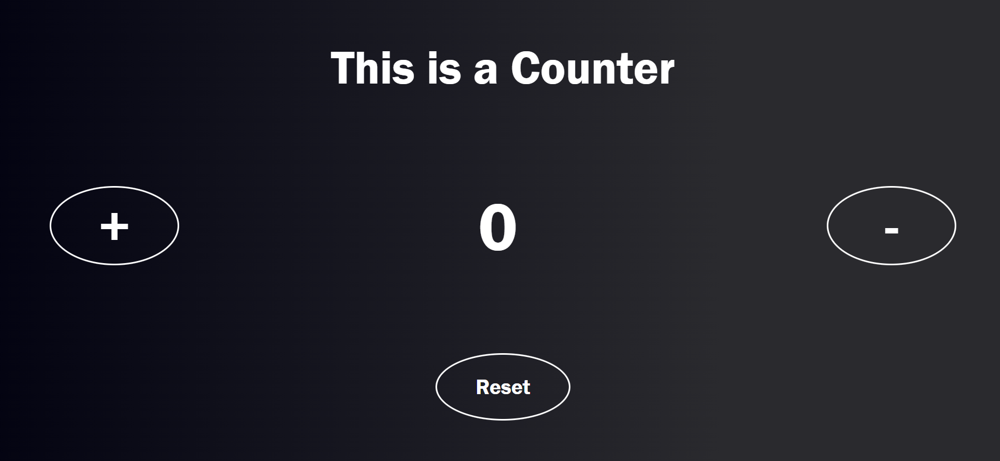

# Counter
> Contatore che ha la possibilità di incrementare,diminuire e resettare il valore.
> Demo [_qui_](https://savino-lanotte-counter.netlify.app/).

## Sommario
* [Info](#info)
* [Tecnologie utilizzate](#tecnologie-utilizzate)
* [Caratteristiche](#caratteristiche)
* [Screenshot](#screenshot)
* [Utilizzo](#utilizzo)

## Info
Contatore che ha la possibilità di incrementare,diminuire e resettare il valore.

## Tecnologie utilizzate
- Javascript
- Html
- Css

## Caratteristiche
- Pulsante (+)
- Pulsante (-)
- Pulsante (Reset)

## Screenshot
 

Screenshoot Counter.

## Utilizzo
- Cliccare il pulsante (+) per aumentare il valore del counter.
- Cliccare il pulsante (-) per diminuire il valore del counter.
- Cliccare il pulsante (Reset) per azzerare il valore del counter.